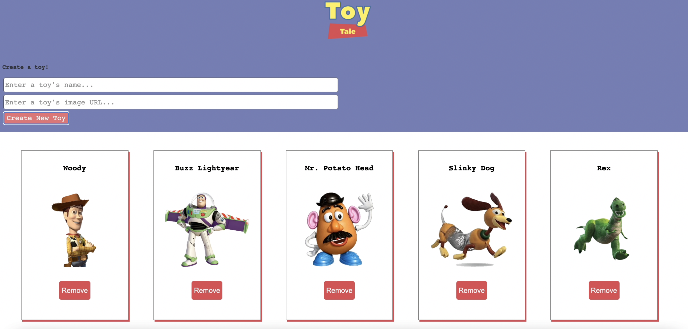
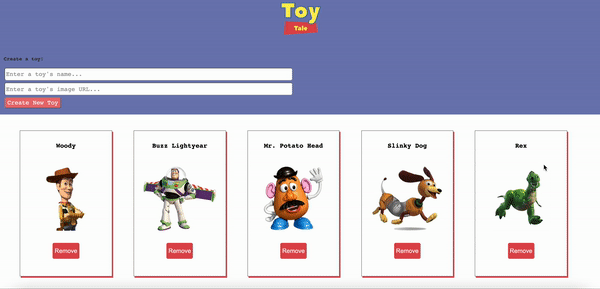

# Fetching to a JSON Server: Mini Project

You will be using JSON Server to create a mock API that you can make `GET`, `POST`, and `DELETE` requests to! You will use this mock API to build out a front-end web app. 

## Decide on your domain

For this project, users should be able to see all their resources, create new resources, and delete resources. Choose a single-model-domain for this project. For example, you can build a car app or a dog app! Here is an example of a toy app where a user can manage all their toys. They can view a list of their toys, create new toys, and remove toys from the web app. You may use the starter code since it has some pre-made styling, or you can make your app from scratch. 


## Install JSON Server

To install JSON Server, run `npm install -g json-server` in your terminal. You can read more about [Getting Started with JSON Server](https://github.com/typicode/json-server#getting-started).

## Create your mock API

Create a file with a `.json` extention. See the included `db.json` as an example. This file should hold a single object with a single key named after your domain; it's value should be an array. For example: 

```
{
  "toys" : []
}
```

Populate your array with at least four items. Don't forgot to give each item an `"id"`. Each item should only have 2-4 properties **not** including the `"id"`:

```
{
  "toys": [
    {
      "id": 1,
      "name": "Woody",
      "image": "http://www.pngmart.com/files/3/Toy-Story-Woody-PNG-Photos.png",
    },
    {
      "id": 2,
      "name": "Buzz Lightyear",
      "image": "http://www.pngmart.com/files/6/Buzz-Lightyear-PNG-Transparent-Picture.png",
    },
    {
      "id": 3,
      "name": "Mr. Potato Head",
      "image": "https://vignette.wikia.nocookie.net/universe-of-smash-bros-lawl/images/d/d8/Mr-potato-head-toy-story.gif/revision/latest?cb=20151129131217",
    },
    {
      "id": 4,
      "name": "Slinky Dog",
      "image": "https://www.freeiconspng.com/uploads/slinky-png-transparent-1.png",
    }
  ]
}
```

> Note: the name of your key is very important because you'll use the same name in the path of your fetch calls! For example: `http://localhost:3000/toys`

Make sure your file is properly formatted. You can use a [JSON Validator](https://jsonlint.com/). 

To start your mock API, run `json-server --watch db.json` in your terminal, where `db.json` is the name of your JSON file.

## Make GET requests

Double check that your mock API is up and running by typing `http://localhost:3000/` into the browser. You should see a JSON Server welcome page. Next, make a `GET` request via the browser by changing the URL in your address bar to `http://localhost:3000/{name-of-your-domain}`. You should see all your data in JSON format. Now make a request to `http://localhost:3000/{name-of-your-domain}/1` and make sure you see a single resource. 

For your project, the first feature you should build out is: When the page loads, a `GET` fetch is made and the user should see all their ____ on the page. Where the blank is cars, or dogs, or whatever your domain is.

Here's an example of the toy project: 



## Make POST requests 

Add a feature where the user can create a new car, or dog, or whatever by filling out a form. Submitting a form should make a `POST` request to your API and add that new item to the DOM **without** having to refresh the page. To double check that your `POST` request is sucessful, when you refresh your web app, any newly created resources should still be there! Remember to send a `body` and `headers` of `{"Content-Type": "application/json"}` in your fetch.


> Pro-tip: If you create too much "bad" data, you can open your `.json` file and manually remove the items from the array. That will give you a clean start when you need one. Just be sure it's always valid JSON and you don't have an extra comma or are missing a character. 

## Make DELETE Request

Add a feature where the user can remove a car, or dog, or whatever. The removed item should be deleted from the API and removed from the DOM **without** having to refresh the page. To make sure the feature works correctly, delete an item which will remove it from the DOM. If you refresh your web app, that will make a fresh `GET` fetch and display all the data. Your deleted resource should still not be there!



### Stretch Features
* Enhance (or completely change up) the style to make this app look and feel completely like your own!
* Experiment with make `fetch` requests to update your Mock API. Look into [`PATCH`](https://developer.mozilla.org/en-US/docs/Web/HTTP/Methods/PATCH) and [`PUT`](https://developer.mozilla.org/en-US/docs/Web/HTTP/Methods/PUT) requsts. 

#### Update Example

In the example below, we've added a property called `likes`, which starts at 0 when a toy is first created. 

```
{
  "toys": [
    {
      "id": 1,
      "name": "Woody",
      "image": "http://www.pngmart.com/files/3/Toy-Story-Woody-PNG-Photos.png",
      "likes" : 0
    },
    {
      "id": 2,
      "name": "Buzz Lightyear",
      "image": "http://www.pngmart.com/files/6/Buzz-Lightyear-PNG-Transparent-Picture.png",
      "likes" : 0
    },
    {
      "id": 3,
      "name": "Mr. Potato Head",
      "image": "https://vignette.wikia.nocookie.net/universe-of-smash-bros-lawl/images/d/d8/Mr-potato-head-toy-story.gif/revision/latest?cb=20151129131217",
      "likes" : 0
    },
    {
      "id": 4,
      "name": "Slinky Dog",
      "image": "https://www.freeiconspng.com/uploads/slinky-png-transparent-1.png",
      "likes" : 0
    }
  ]
}
```

In the demo below, when a user click's on a toy's Like button, it makes a `PATCH` requests to increment that toy's `likes` by 1. This change persists because a refresh of the page will show the like count has been "saved" to the JSON Server.


